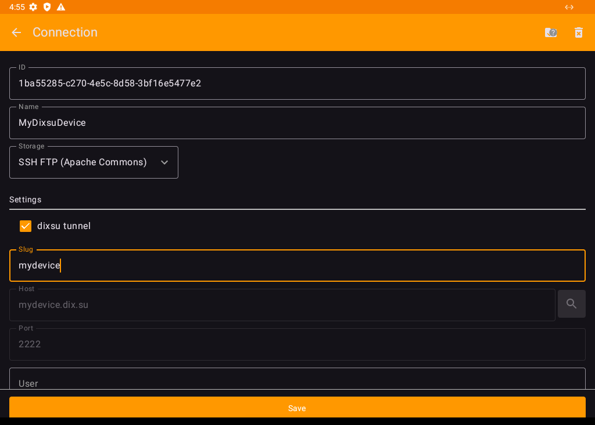
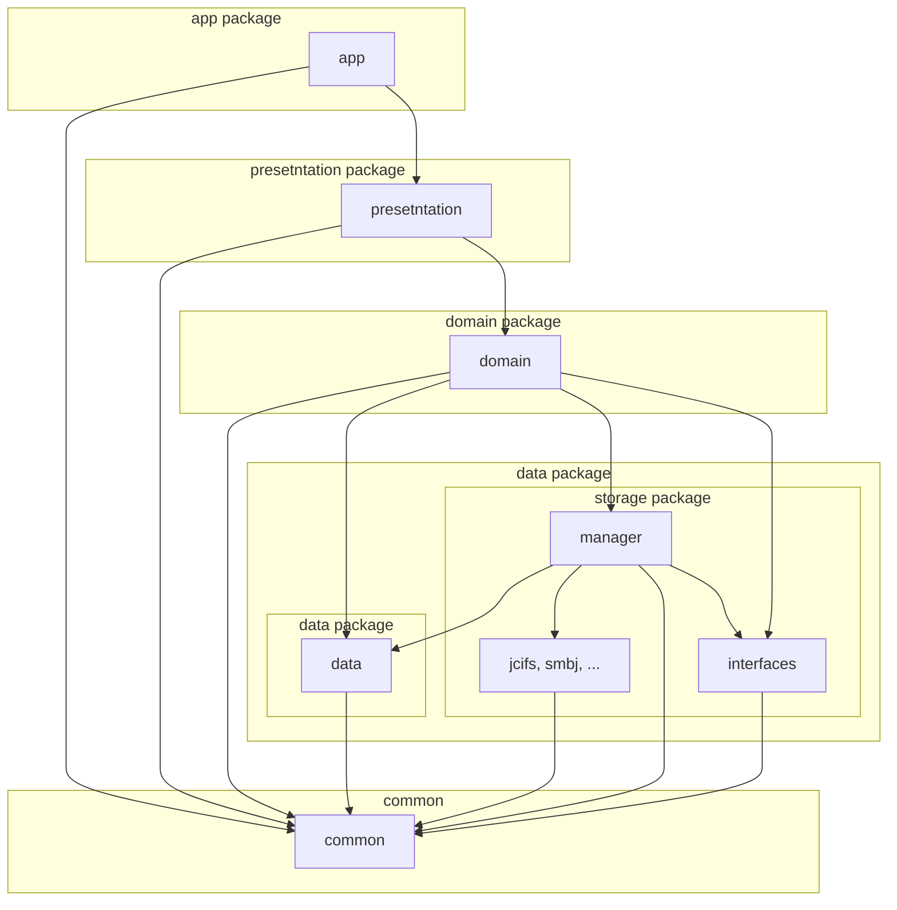

CIFS Documents Provider (dix.su)
=======================

## About

**CIFS Documents Provider (dix.su)** is a fork of [wa2c/cifs-documents-provider](https://github.com/wa2c/cifs-documents-provider) — an Android app that provides access to shared network storage (SMB, FTP, SFTP, WebDAV and more) directly through the system's file picker (Storage Access Framework), no separate file-browser UI needed.

This fork adds support for **dix.su tunnels**: connect to an SFTP device sitting behind NAT/CGNAT through a [dix.su](https://dix.su) tunnel — just enter the device's slug, no port forwarding, no VPN, no extra steps on the device.

## What's different from the original

- New **"dixsu tunnel"** toggle on SFTP connections. Turn it on, enter a device slug — the app resolves `<slug>.dix.su:2222`, performs the tunnel handshake, and the connection behaves like a normal SFTP server from then on.
- Renamed/rebranded (`applicationId su.dix.cifsdocumentsprovider`) so it installs and updates independently of the original app — both can be installed on the same device without conflict.
- See [CHANGELOG.md](CHANGELOG.md) for the full list of changes.

## Download

### GitHub Releases

* [Release history / APK download](https://github.com/ramanzes/dix.su.cifsdocumentsprovider/releases)

RuStore and F-Droid listings are planned but not published yet.

## Source Code

* This fork: [github.com/ramanzes/dix.su.cifsdocumentsprovider](https://github.com/ramanzes/dix.su.cifsdocumentsprovider)
* Original project: [wa2c/cifs-documents-provider](https://github.com/wa2c/cifs-documents-provider)

## Module Structure

## Guide

* [Wiki (original project)](https://github.com/wa2c/cifs-documents-provider/wiki) — general usage of the base app. The dixsu tunnel feature is described above and in [CHANGELOG.md](CHANGELOG.md).

## Licence

Copyright &copy; 2020 wa2c. dixsu tunnel additions Copyright &copy; 2026 ramanzes / dix.su.
[MIT License](LICENSE)

## Author

* [wa2c](https://github.com/wa2c) — original author
* [ramanzes](https://github.com/ramanzes) ([dix.su](https://dix.su)) — this fork, dixsu tunnel support
